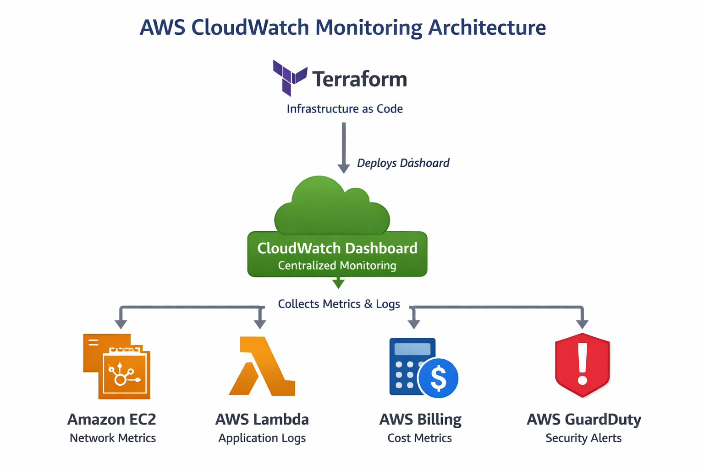
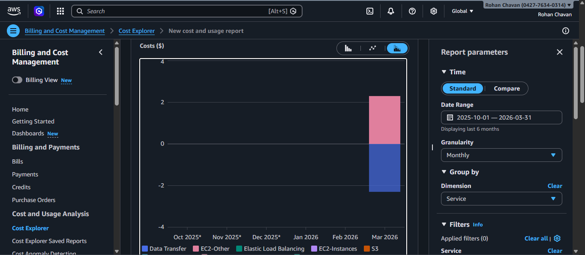
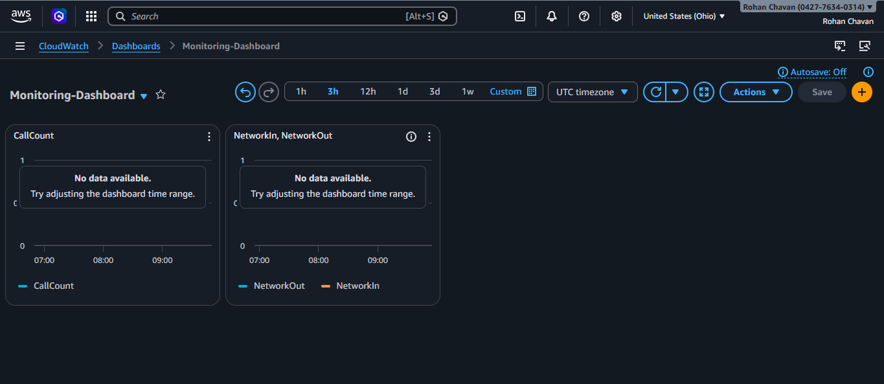
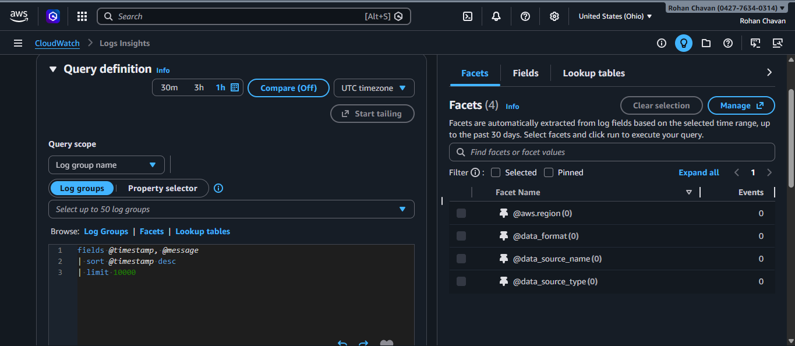
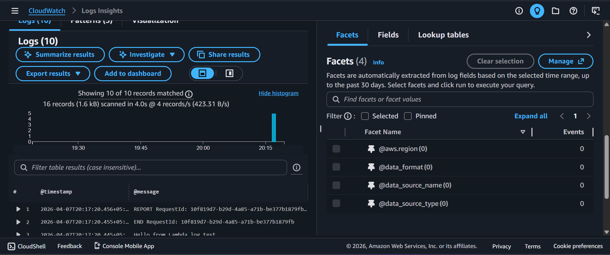
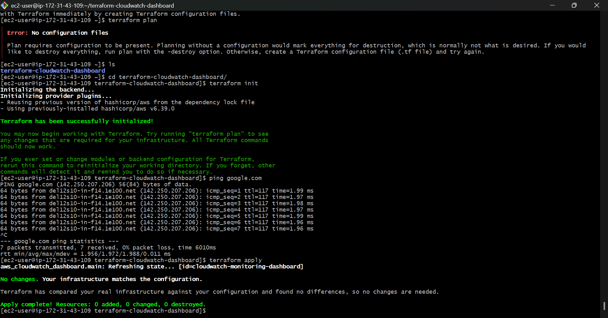

#  AWS CloudWatch Dashboard For Comprehensive Monitoring

##  Project Overview

This project demonstrates how to build a **centralized monitoring system on AWS using Amazon CloudWatch Dashboards**.

The dashboard provides **real-time visibility into cost, logs, network performance, and security insights** across multiple AWS services.

Infrastructure provisioning and dashboard deployment are **automated using Terraform**, making the solution scalable and reproducible.

---

#  Architecture Diagram





---

#  AWS Services Used

| Service           | Purpose                               |
| ----------------- | ------------------------------------- |
| Amazon CloudWatch | Centralized monitoring and dashboards |
| AWS Lambda        | Generates application logs            |
| Amazon EC2        | Provides network performance metrics  |
| AWS Cost Explorer | Tracks billing and cost data          |
| AWS GuardDuty     | Detects security threats              |
| Terraform         | Automates infrastructure deployment   |

---

#  Project Structure

```
aws cloudwatch dashboards for comprehensive monitoring
│
├── dashboard
│   └── dashboard.json
│
├── terraform
│   ├── provider.tf
│   └── main.tf
│
├── img
│   ├── architecture-diagram.png
│   ├── network-dash.png
│   ├── lambda-function-log.png
│   ├── logs.png
│   ├── terraform-apply.png
│   └── lambda-function-log-2.png
│
└── README.md
```

---

#  Terraform Configuration

Terraform is used to **deploy the CloudWatch dashboard automatically**.

### main.tf

```hcl
resource "aws_cloudwatch_dashboard" "main" {
  dashboard_name = "cloudwatch-monitoring-dashboard"

  dashboard_body = file("../dashboard/dashboard.json")
}

```

---

#  Deployment Steps

## 1.  Configure AWS credentials

Run the following command and enter your AWS credentials.

```bash
aws configure
```

Provide:

* AWS Access Key
* AWS Secret Key
* Default Region (example: ap-south-1)

---

## 2.  Initialize Terraform

```bash
terraform init
```

---

## 3.  Preview infrastructure changes

```bash
terraform plan
```

---

## 4.  Deploy the dashboard

```bash
terraform apply
```

Type:

```
yes
```

Terraform will automatically create the **CloudWatch monitoring dashboard**.

---

#  Billing & Cost Monitoring

This section visualizes **AWS service cost and estimated charges**.

### Metrics Monitored

| Metric           | Description                    |
| ---------------- | ------------------------------ |
| EstimatedCharges | Total AWS estimated billing    |
| Service Cost     | Cost breakdown per AWS service |

###



---

#  Network Performance Monitoring

This section monitors **EC2 network traffic and load balancer metrics**.

### Metrics Monitored

| Metric       | Description                 |
| ------------ | --------------------------- |
| NetworkIn    | Incoming network traffic    |
| NetworkOut   | Outgoing network traffic    |
| RequestCount | Load balancer request count |
| Latency      | Response time               |



---

#  Logs Monitoring

Logs are analyzed using **CloudWatch Logs Insights**.

### Log Insights Query

```sql
fields @timestamp, @message
| sort @timestamp desc
| limit 20
```

This query retrieves the **latest log events from the Lambda function**.





---

#  Security Monitoring

Security visibility is integrated using **AWS GuardDuty findings**.

### Metrics Monitored

| Metric             | Description              |
| ------------------ | ------------------------ |
| GuardDuty Findings | Security alerts detected |
| Threat Detection   | Suspicious activities    |

---

### Terraform Deployment





---

#  Key Learnings

Through this project I gained hands-on experience with:

* AWS CloudWatch monitoring and dashboards
* CloudWatch Logs Insights for log analysis
* AWS cost monitoring
* Network performance monitoring
* Security monitoring using GuardDuty
* Infrastructure automation using Terraform

---

#  Future Improvements

Possible enhancements:

* CloudWatch alarms
* SNS notifications for alerts
* CloudTrail monitoring
* Grafana dashboard integration

---
---

#  Conclusion

This project demonstrates how **AWS CloudWatch Dashboards can be used to build a centralized monitoring solution** for cloud infrastructure. By integrating services like **EC2, Lambda, Cost Explorer, and GuardDuty**, the dashboard provides visibility into **cost usage, application logs, network performance, and security insights**.  

Using **Terraform for Infrastructure as Code (IaC)** enables automated and consistent deployment of the monitoring setup, aligning with modern **DevOps practices for observability and infrastructure management**.

### Author

Rohan Chavan